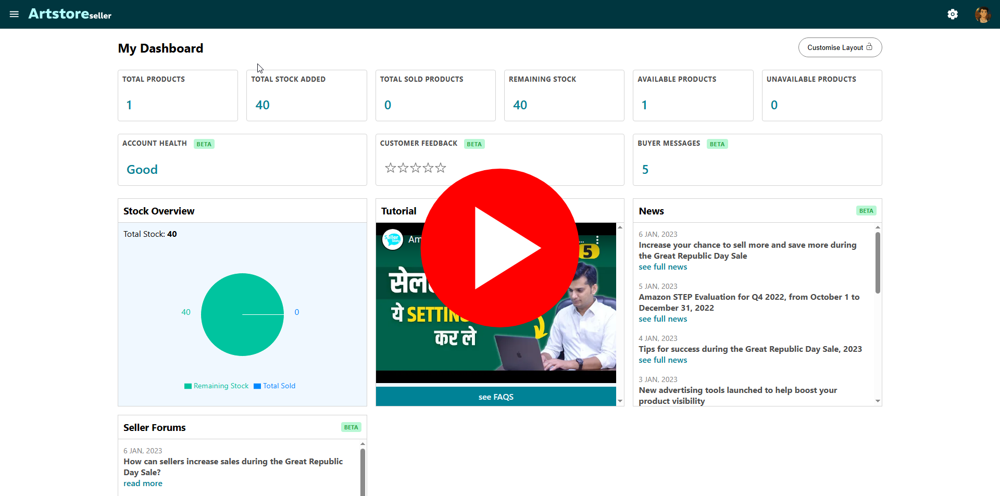

# 🛍️ Artstore Seller

A modern **Seller Dashboard** built for e-commerce platforms, enabling sellers to manage products, view analytics, and streamline store operations.  
Built with **TypeScript** and integrated with **Gemini AI**, this project delivers a smooth and efficient seller experience.

---

## 🔗 Live Demo

👉 [View the Seller Dashboard](https://artstoreseller.vercel.app)

---

## 🎥 Project Preview

Click the image below to watch the full demo on YouTube 👇  

---

## 📬 API & Postman Collection

The backend APIs are documented using **Postman** for easy testing and understanding.

Click the image below to watch the API walkthrough 👇  

[Postman Collection Preview](https://www.youtube.com/watch?v=YOUR_VIDEO_ID)

---

## 🚀 Features

### 🧾 Product Management
- Create, edit, and update products
- Toggle product availability
- Upload product images and details
- Create/Edit store details

### 📊 Dashboard & Analytics
- View seller statistics
- Track product performance
- Monitor stock and sales

### 🤖 AI Integration
- **Gemini AI** powered product description generation

### 📱 Responsive Design
- Optimized for desktop and mobile devices
- Clean and modern UI/UX

---

## 🛠️ Tech Stack

- **Frontend:** React + TypeScript  
- **Styling:** CSS  
- **AI Integration:** Gemini AI  
- **Backend:** Node.js / Express.js  
- **Database:** MongoDB atlas (cloud based) 

---

## 🔐 Authentication

- Secure seller authentication
- Token-based authorization for protected routes

---

## 📌 Notes

- This project is built as a **seller-focused dashboard**
- Designed to demonstrate real-world e-commerce workflows
- Ideal for showcasing **full-stack & dashboard development skills**

---

## 📞 Contact

If you’d like to discuss this project or collaborate, feel free to reach out!

---

⭐ If you like this project, don’t forget to star the repository!
